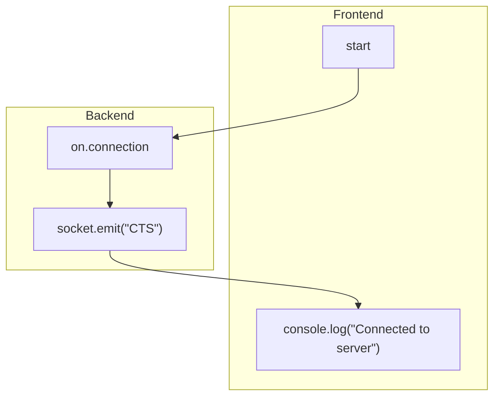
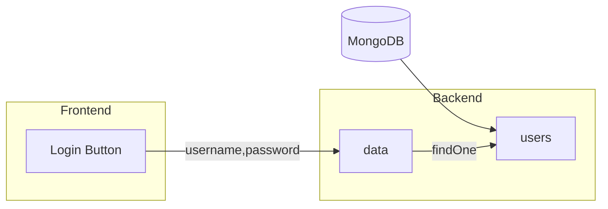

# Data flow in Link-Up


## Testing for client-server connection

I set this data flow to check if frontend is sucessfully connected with backend on deployment



---
## Login Page

```bash
https://getlinkup.vercel.app/login
```
