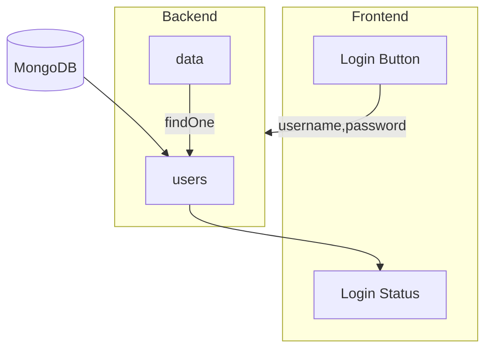

## Login Page

```bash
https://getlinkup.vercel.app/login
```

```mermaid
    flowchart TD
        A -- username,password --> Backend
        DB --> users
        users --> T
        subgraph Frontend
            A["Login Button"]
            T["Login Status"]
        end
        subgraph Backend
            B["data"]
            B -- findOne --> users
        end
        DB[("MongoDB")]
```