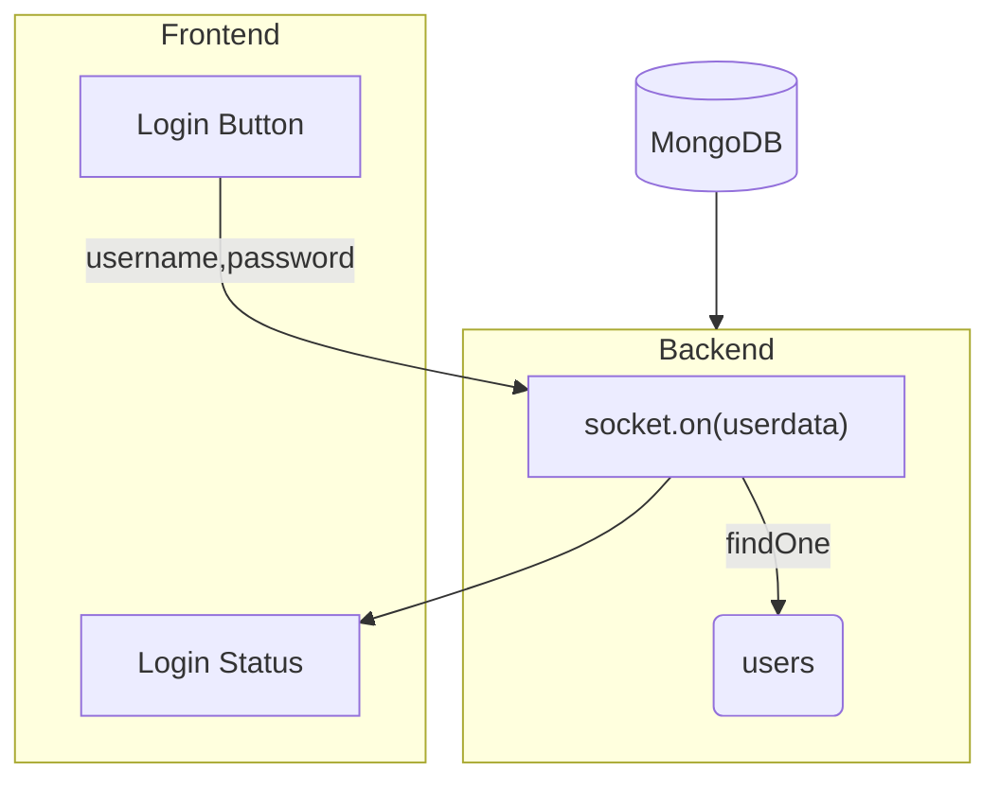

# Login Page
```bash
https://getlinkup.vercel.app/login
```
In the Login page of LinkUp the following logic is implemented..
When the user clicks on the `login button`. it takes the input value of `email` and `password`.

| [Issue #4](https://github.com/arpittyagirocks/LinkUp/issues/4) | 
| -------- |         
| Here even if the fields are empty it still tries to send response to Backend |
| There is no Validator which confirms that value entered in `email` field is a valid email or not |

There it emits a socket event 
```javascript
socket.emit("login-attempt", {
    email : emailinput,
    password : passwordinput
})
```
<br/>

And the Backend catches these values and sends the response accordingly
```javascript
socket.on("login-attempt",async (userdata) =>{
    const users = db.collection('users');
    const user = await users.findOne({email:userdata.email})
    // Retrieving Users data from MongoDB

    if(!user)  
        socket.emit( "login-attempt-response" , "WRONGEMAIL" )
    // Response if there is email is wrong
    else if( user.email===userdata.email && user.password===userdata.password )
        socket.emit( "login-attempt-response","SUCCESSFULL" )
    // Response if both email and password is correct
    else if( user.email===userdata.email && user.password!==userdata.password )
        socket.emit( "login-attempt-response" , "WRONGPASSWORD" )
    // Response if email is correct but password is wrong
    else
        socket.emit( "login-attempt-response" , "UNSUCCESSFULL" )
    })
    // Any other error
```

Now if the Frontend gets the response to be SUCCESSFULL it redirects to the `/chat` page




